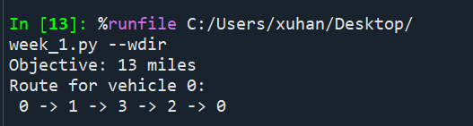

# Week_1 Report 
1. Baseline Tools
  - OR-Tools
2. Environmrnt Record
  - Operating system: Windows 11
  - Python version: 3.12.13
  - Package manager: Conda
  - Solver or codebase version: 9.15.6755
  - Exact install commands: conda activate or-tools-env
  - Hardware used for runtime: Intel Core ULTRA 9
3. Smoke Test
  - [python](#test)
  - Command:
    ```bash
    conda activate or-tools-env
    python tsp_test.py
    ```
  - Instance name and size:
    - Instance name: Tiny TSP Test Instance
    - Size: 4 nodes, 1 vehicle
  - Feasibility status: Feasible
  - Runtime: About 0.01s
  - Textual route output:
  
4. Reflection
  - The easiest constraint to understand in the TSP was the requirement that the route must start and end at the depot, which corresponds to depot = 0 in the code.
  - Initially, I was confused about the meaning of the Objective value, but later I understood that it represents the total distance of the entire route.
  - For Week 2, my baseline target is to extend the single-vehicle TSP model to a multi-vehicle VRP, and add more practical constraints such as vehicle capacity limits.
## Test

#Start spyder in Anaconda PowerShell Prompt
```bash
conda activate or-tools-env
spyder --new-instance
```

#Import dependencies
```bash
from ortools.constraint_solver import routing_enums_pb2
from ortools.constraint_solver import pywrapcp
```

#A tiny TSP instance consisting of four points and one vehicle
```bash
def create_data_model():
    data = {}
    data["distance_matrix"] = [
        [0, 2, 5, 7],
        [2, 0, 3, 4],
        [5, 3, 0, 2],
        [7, 4, 2, 0]
    ]
    data["num_vehicles"] = 1
    data["depot"] = 0
    return data
```

#Compute and print the objective value, cumulative route distance, and vehicle visitation sequence
```bash
def print_solution(manager, routing, solution):
    print(f"Objective: {solution.ObjectiveValue()} miles")
    index = routing.Start(0)
    plan_output = "Route for vehicle 0:\n"
    route_distance = 0
    while not routing.IsEnd(index):
        plan_output += f" {manager.IndexToNode(index)} ->"
        previous_index = index
        index = solution.Value(routing.NextVar(index))
        route_distance += routing.GetArcCostForVehicle(previous_index, index, 0)
    plan_output += f" {manager.IndexToNode(index)}\n"
    print(plan_output)
    plan_output += f"Route distance: {route_distance}miles\n"
```

#Instantiate the data problem and create the routing index manager and model
```bash
def main():
    data = create_data_model()

    manager = pywrapcp.RoutingIndexManager(
        len(data["distance_matrix"]), data["num_vehicles"], data["depot"]
    )

    routing = pywrapcp.RoutingModel(manager)
```

#Convert from routing variable Index to distance matrix NodeIndex
```bash
def distance_callback(from_index, to_index):
        from_node = manager.IndexToNode(from_index)
        to_node = manager.IndexToNode(to_index)
        return data["distance_matrix"][from_node][to_node]

    transit_callback_index = routing.RegisterTransitCallback(distance_callback)
```

#Define cost of each arc
```bash
routing.SetArcCostEvaluatorOfAllVehicles(transit_callback_index)
```

#Set first solution heuristic
```bash
search_parameters = pywrapcp.DefaultRoutingSearchParameters()
    search_parameters.first_solution_strategy = (
        routing_enums_pb2.FirstSolutionStrategy.PATH_CHEAPEST_ARC
    )
```

#Solve the problem
```bash
solution = routing.SolveWithParameters(search_parameters)
```

#print solution on console
```bash
if solution:
        print_solution(manager, routing, solution)
```

#Entry point of the program
```bash
if __name__ == "__main__":
    main()
```