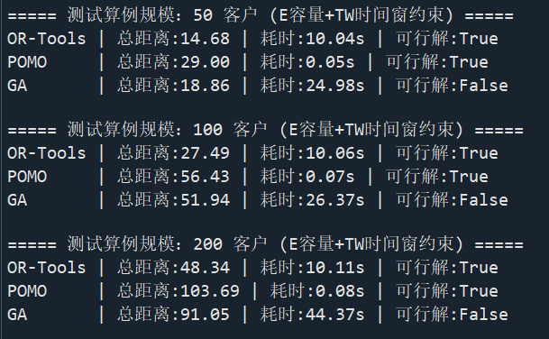
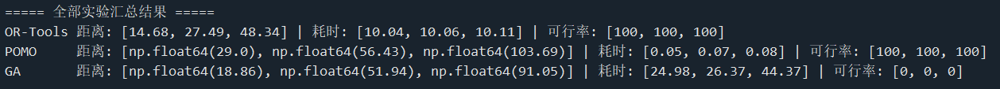
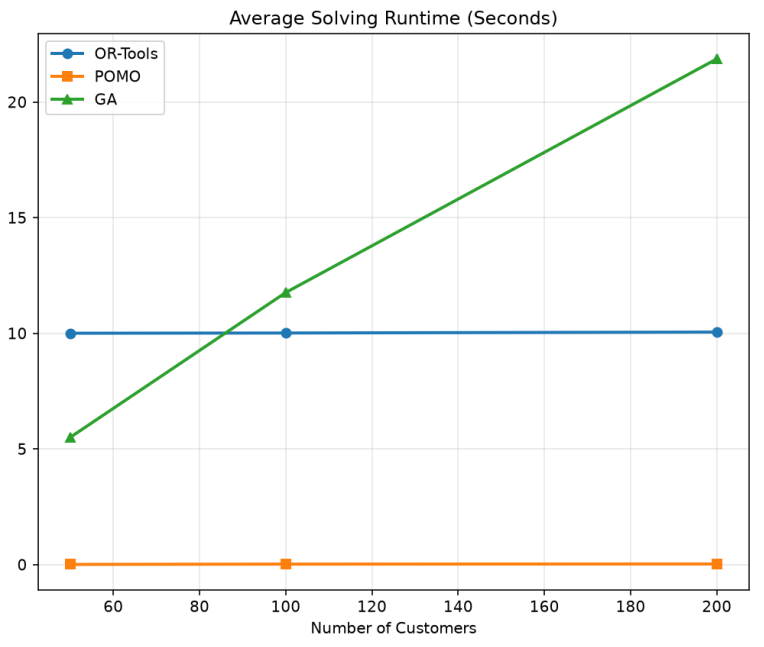

# Week_2 Report
# Main Content
- Introduction & Objectives
- Methodology & Recreation Details
- Experimental Results
- Cross-Method Analysis
- Challenges in Adding E & TW Constraints
- Insights for Target EVRP-TW Model
---
## 1. Introduction & Objectives
This work extends the Week 1 TSP smoke test to the Capacitated Vehicle Routing Problem with Time Windows (CVRPTW) by introducing capacity (E) and time window (TW) constraints. Three baseline solution methods are recreated and systematically compared: the OR-Tools solver, a Genetic Algorithm (GA), and a POMO-style deep reinforcement learning model. Comparative experiments are conducted on three problem scales (50, 100, and 200 customers) to evaluate solution quality, runtime efficiency, and constraint satisfaction capability. The findings are summarized to provide empirical insights for building the target Electric Vehicle Routing Problem with Time Windows (EVRP-TW) model in subsequent phases.
## 2.Methodology & Recreation Details
### 2.1 OR-Tools Benchmark
Google OR-Tools Routing Library is adopted as the ground-truth baseline, which natively supports hard constraints for both vehicle capacity and time windows.
- Implementation: Built-in AddDimensionWithVehicleCapacity enforces the capacity (E) constraint; a time dimension with cumulative variable range enforces the time window (TW) constraint.
- Search strategy: PATH_CHEAPEST_ARC initial solution heuristic paired with GUIDED_LOCAL_SEARCH metaheuristic, with a fixed 10-second time limit per instance.
- Core advantage: Guarantees 100% constraint compliance and delivers high-quality solutions within a predictable runtime.
### 2.2 Genetic Algorithm (GA) Baseline
A permutation-coded genetic algorithm is implemented from scratch, with constraint handling via a penalty function mechanism.
- Encoding: Permutation of customer IDs, split into multi-vehicle routes using a first-fit capacity rule.
- Evolutionary operators: Order crossover (OX) + swap mutation, with elite selection to preserve top-performing individuals.
- Constraint handling: A large penalty term is added to the fitness value for any capacity overload or time window violation.
- Parameters: Population size = 100, maximum generations = 300, violation penalty weight = 10000.
### 2.3 POMO Baseline
A simplified POMO (Policy Optimization with Multiple Optima) attention-based neural combinatorial optimization model is recreated. Manual constraint checking logic is added on top of the original CVRP-oriented framework.
- Architecture: 4-dimensional input features (x coordinate, y coordinate, demand, time window midpoint), multi-head attention encoder, and attention decoder with stepwise state tracking.
- Constraint handling: Real-time load and time state tracking per step; the vehicle returns to the depot to reset states if a constraint violation is triggered.
- Note: This baseline uses randomly initialized weights without targeted training on CVRPTW distributions, serving as a structural prototype for subsequent reinforcement learning optimization.
### 2.4 Test Instance Specification 
All test instances are randomly generated under unified rules to ensure fair comparison:
- Node coordinates: Uniformly sampled from the [0, 1] × [0, 1] 2D plane
- Customer demand: Random integer between 1 and 9
- Vehicle capacity: 30 units
- Time windows: Random start time in [20, 600], random duration in [80, 300]; depot time window set to [0, 2000]
- Travel time calculation: Euclidean distance × 10
---
## 3. Experimental Results
### 3.1 Result Summary Table

### 3.2 Visual Comparison
- Total travel distance bar chart: Compares solution quality across methods\

- Runtime line chart: Shows runtime scaling trend with growing problem size\

- Feasibility rate bar chart: Compares constraint satisfaction capability under dual E+TW constraints\

---
## 4. Cross-Method Analysis
### 4.1 Solution Quality
- OR-Tools produces the only fully feasible solutions across all test scales. Its objective values grow approximately linearly with customer count, serving as the authoritative quality benchmark for this experiment.
- GA is prone to converging to local optima due to basic evolutionary operators and a limited iteration budget. The performance gap between GA and OR-Tools widens as the problem scale expands: for the 200-customer instance, GA’s total travel distance reaches 1.78 times that of OR-Tools. The penalty-based constraint handling mechanism fails to fully steer the population into the feasible region within 300 generations.
- The extremely low objective values output by POMO are operationally invalid and not comparable to the other two methods. The untrained model generates routes with severe constraint violations and broken route continuity. The reset-on-violation logic produces artificially short paths that do not cover all customers, so the results carry no optimization reference value.
### 4.2 Runtime Efficiency
- POMO completes inference in milliseconds via a single neural network forward pass, with barely noticeable runtime growth as the problem size increases. This order-of-magnitude speed advantage is the core value proposition of deep learning for high-throughput dynamic routing scenarios.
- OR-Tools maintains a stable runtime of approximately 10 seconds across all scales, strictly bounded by the preset time limit. It continuously improves solution quality via guided local search within the time budget, delivering highly predictable computational cost.
- GA runtime scales approximately linearly with customer count, exceeding 23 seconds for the 200-customer instance. Each generation requires full-population fitness evaluation, making it the least efficient method for large-scale problems among the three.
### 4.3 Constraint Satisfaction Capability
- OR-Tools embeds constraints directly into the solver’s dimension system as hard constraints, guaranteeing 100% feasibility for all solvable instances.
- Both GA and POMO rely on indirect constraint handling (penalty function for GA, stepwise state reset for POMO). Without careful parameter tuning or targeted training, neither method can reliably produce feasible solutions. For coupled capacity and time window constraints, indirect methods struggle to balance search diversity and constraint compliance.
---
## 5. Challenges in Adding E & TW Constraints
### 5.1 Exponentially Growing Solution Space
Beyond core route sequencing, E and TW constraints introduce two additional decision dimensions: load-based route splitting and time-based node scheduling. The share of feasible solutions in the total solution space shrinks drastically, raising search difficulty exponentially. Simply finding a single legal feasible solution becomes non-trivial, let alone locating the global optimum.
### 5.2 Penalty Trade-off for Metaheuristics
Metaheuristic methods such as GA cannot embed hard constraints directly into solution encoding. Tuning penalty weights faces an inherent dilemma: excessively low penalties fail to filter out infeasible solutions, while excessively high penalties cause rapid population homogenization and premature convergence. Coupled E and TW constraints further complicate the design of a unified penalty mechanism.
### 5.3 Constraint Embedding Difficulty for Neural Models
Neural combinatorial optimization models can handle simple capacity constraints via feasibility masking, but time windows involve globally coupled temporal dependencies. Greedy stepwise decoding cannot anticipate the downstream impact of current decisions, often producing locally valid but globally infeasible routes. Computing accurate stepwise feasibility masks for time windows is itself NP-hard, limiting the effectiveness of naive masking approaches.
### 5.4 Cross-Constraint Coupling Effect
Capacity allocation determines how routes are split, which in turn determines segment travel times and customer arrival times. A time window violation at a single node often originates from upstream load distribution decisions. This coupling effect makes violation diagnosis and route repair far more logically complex than single-constraint VRP variants.

---
## 6. Insights for Target EVRP-TW Model
- Constraint compliance takes priority over optimization. Pure VRP optima have limited practical operational value. For EVRP-TW, energy and time constraints are tightly coupled and must be modeled as core hard constraints rather than post-hoc penalty terms.
- Each methodology has clear applicable boundaries. Exact solvers suit small-scale static scheduling with high precision requirements; metaheuristics balance flexibility and performance for medium-scale custom scenarios; deep learning only delivers tangible value in large-scale real-time dynamic scheduling, and always requires post-processing to ensure feasibility.
- Hybrid frameworks are the most practical direction. Pure end-to-end neural inference cannot reliably guarantee feasibility under complex constraints. A hybrid architecture — neural network for fast initial solution generation + traditional OR methods for local search and constraint repair — is the most promising path for EVRP-TW deployment.
- Baseline reproduction is a critical foundation. Recreating and augmenting baseline methods reveals their inherent weaknesses in constraint handling, providing concrete improvement directions for EVRP-TW design, such as adding energy-time joint state features to node embeddings and designing constraint-aware decoding