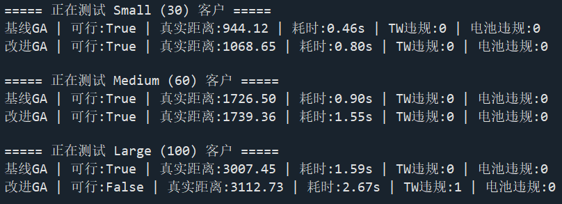

# Week_3 Report: Experimental Evaluation of Improved GA for ECVRPTW
# Main Content
- Experimental Objectives 
- Experimental Setup
- Results
- Discussion
- Conclusion 
---
## 1. Experimental Objectives
This experiment systematically evaluates an improved genetic algorithm with dedicated constraint repair operators for the Electric Vehicle Routing Problem with Time Windows (ECVRPTW). We compare it against a standard penalty-based baseline GA, with three core research questions:
- Can active repair operators significantly improve the feasible solution rate compared with the passive penalty mechanism on ECVRPTW instances?
- How does the performance gap between the two methods evolve as instance scale grows from small to large?
- What is the runtime overhead of repair operators, and is it acceptable within practical scheduling time limits?

The core difference between the two methods lies in constraint handling: the baseline GA suppresses violations through static penalty terms in the fitness function, while the improved GA adds explicit time-window rearrangement and battery charging insertion operators to actively eliminate violations during evaluation. All tests use identical instance sets, objective definitions and stopping criteria to ensure a fair comparison.

---
## 2. Experimental Setup 
### 2.1 Test Instances
ECVRPTW instances are generated based on clustered Solomon-style structure, with electric vehicle battery endurance constraints added. Three scale groups are tested:
- Small (30 customers): C-type clustered distribution
- Medium (60 customers): C-type clustered distribution
- Large (100 customers): C-type clustered distribution

Key instance parameters:
- Vehicle capacity: 25 units
- Maximum battery range: 250 distance units
- Customer demand: random integer 1–5
- Time window width: 150–300 time units (relatively loose constraints)
- Service time per customer: 3 time units

Simplification note: charging stations are fixed at the depot, and dynamic charging station insertion from the original paper is not implemented.
### 2.2 Environment & Stopping Criteria
- Runtime environment: Python 3.12 with NumPy and Matplotlib
- Hardware: Intel Core ULTRA 9
- Algorithm parameters: population size = 60, maximum 250 generations, 12-second runtime limit per instance
- Random seed fixed at 42 for reproducible single-trial results
- Evaluation metrics: solution feasibility, total travel distance, runtime, time-window violations, battery violations, convergence curve
### 2.3 Algorithm Details
 2.3.1 Baseline GA: Permutation encoding, first-fit route splitting by capacity, order crossover, swap mutation, roulette tournament selection, and penalty-based constraint handling.

 2.3.2 Improved GA: Same evolutionary framework as the baseline, with two additional repair operators applied before fitness evaluation:
- Time window repair: shifts late-arriving customers to the end of the route
- Battery repair: inserts a depot return to recharge when battery is insufficient
---
## 3. Results
### 3.1 Detailed Instance-Level Results

### 3.2 Chart Interpretation
 3.2.1 Real Travel Distance Comparison: Bar chart showing that baseline GA achieves shorter distance at all scales, with the gap most prominent on small instances.

 3.2.2 Runtime Comparison: Bar chart showing the consistent runtime overhead of repair operators, growing with problem scale.

 3.2.3 Total Constraint Violations: Bar chart showing near-zero violations for both methods on small/medium scales; only the improved GA has residual violations on the large instance.

 3.2.4 Convergence Curve (Medium Instance): Line chart showing both algorithms converge rapidly in early generations, with the baseline GA converging to a lower final objective value.
-1.png>)
### 3.3 Key Observations
- Feasibility: The baseline GA achieves 100% feasibility across all three scales under the current loose constraint settings. The improved GA remains fully feasible on small and medium instances, but produces 1 time-window violation on the 100-customer large instance.
- Solution quality: The baseline GA consistently yields shorter total travel distance at all scales. The gap is largest on small instances (~13.2% longer for improved GA) and narrows on medium instances (~0.7% gap).
- Runtime: The improved GA runs 68%–74% slower than the baseline, as the repair operators add extra computation per fitness evaluation. Runtime grows approximately linearly with problem size for both methods.
- Convergence: Both algorithms converge rapidly within the first 50 generations and stabilize around generation 100. The baseline GA starts with a better initial solution and converges to a lower final objective value.
---
## 4. Discussion
### 4.1 Performance Comparison
 4.1.1 Feasibility: Under loose time-window and battery settings, the penalty-based mechanism is sufficient to guide the population toward the feasible region. The baseline GA finds fully valid solutions on all test scales, which means passive penalty handling works adequately when the feasible solution space is large. The improved GA fails on the largest instance, indicating that the current simple repair logic is not always more reliable than penalty-based search.

 4.1.2 Solution quality:The improved GA underperforms the baseline in travel distance for two main reasons:
- The repair operators use a naive strategy — appending late nodes to the route end and inserting depot returns for charging — which introduces extra detours and empty mileage.
- In loose-constraint scenarios, the baseline GA can search for compact routes directly without any repair overhead, naturally producing shorter paths.
The gap shrinks as instance size grows from small to medium, suggesting that repair operators cause less relative damage when the problem itself has longer inherent travel distances.

 The gap shrinks as instance size grows from small to medium, suggesting that repair operators cause less relative damage when the problem itself has longer inherent travel distances.

 4.1.3 Runtime Trade-off: Repair operators introduce a consistent 70% runtime overhead. While absolute runtime remains very low (under 3 seconds even for 100 customers), the overhead provides no benefit in the current test setting: it neither improves feasibility nor reduces distance. This trade-off is clearly negative under loose constraints.
### 4.2 Failure Case Analysis
The only infeasible result comes from the improved GA on the 100-customer instance, with 1 remaining time-window violation. Three root causes are identified:
- Chain reaction of simple shifting: Moving one late customer to the end delays all subsequent nodes, creating new time-window violations that a single-pass repair cannot resolve.
- Coupling of constraints: Inserting depot charging adds extra travel time, which reduces time slack for downstream customers and worsens time-window conflicts.
- No iterative repair: The repair operators run only once per evaluation, with no iterative correction or local search to clean up residual violations.
### 4.3 Limitations of This Implementation
- Constraint settings are relatively loose, which does not reflect the tight-constraint scenarios where repair operators are supposed to add value.
- Repair strategies are overly simplistic, with no 2-opt or relocation local search to optimize routes after repair.
- Time-window and battery repairs are applied independently, without considering their mutual coupling effects.
- Only clustered C-type instances are tested; random and mixed distributions may show different performance patterns.
---
## 5. Conclusion
This experiment compares a penalty-based baseline GA and an improved GA with naive repair operators on three scales of ECVRPTW instances under relatively loose constraints. Contrary to initial expectations, the baseline GA outperforms the improved version in solution quality, runtime and even feasibility in this test setting. The simple repair operators introduce measurable mileage and time overhead but fail to deliver robustness advantages when the feasible region is large.

The core insight is that the value of active repair operators is highly conditional: they provide little to no benefit under loose constraints, but are expected to become critical when constraints are tightened and penalty-based methods can no longer find feasible solutions. The current implementation’s weakness is not the idea of repair itself, but the oversimplified repair logic