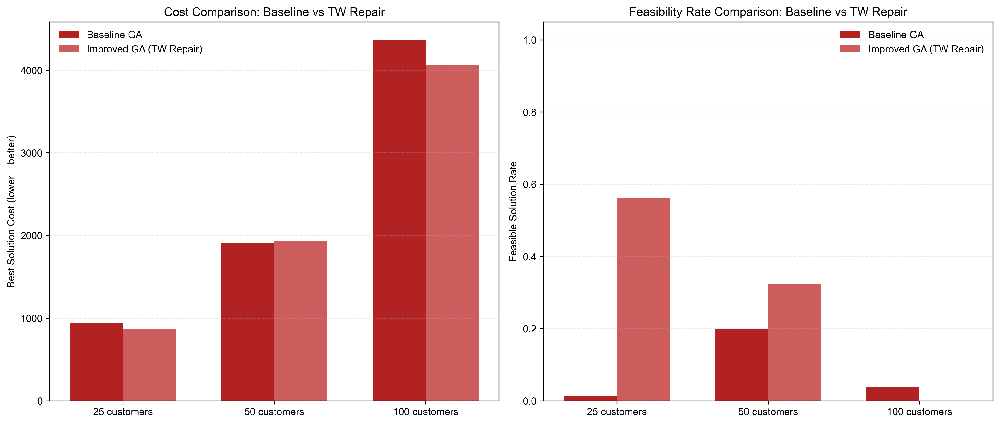
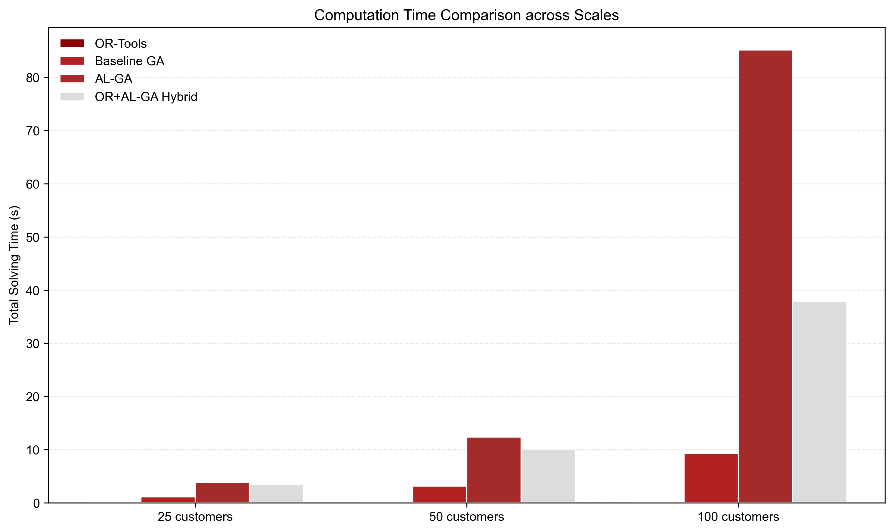
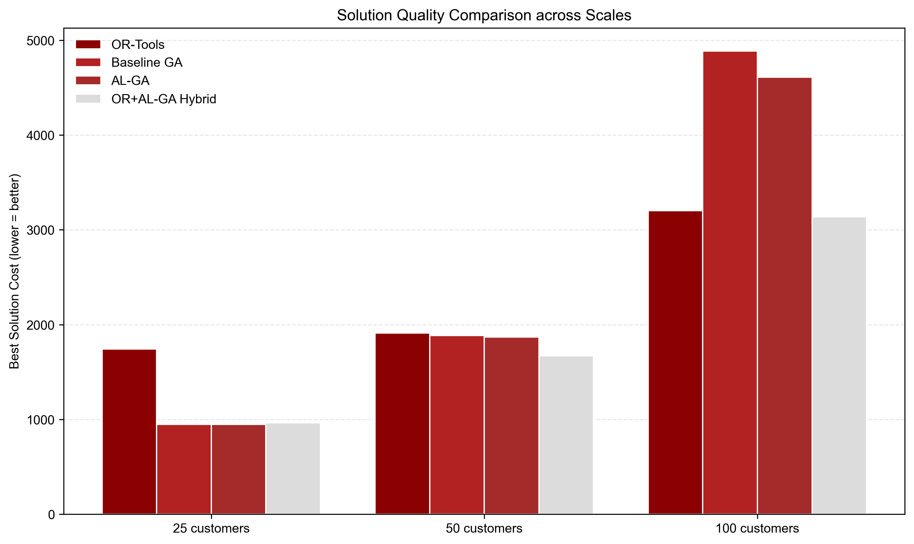
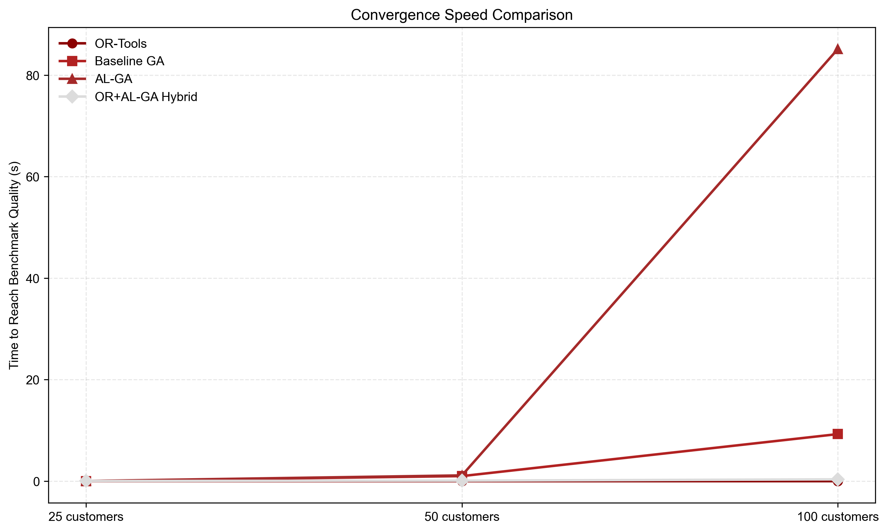

# Main Content
- Compare notes across papers
- Meaningful improvement
- Experiments at multiple scales
- Discuss successes and failures clearly
---
## 1. Compare notes across papers
### 1.1 Paper Notes
### Note 1: ALNS for ECVRPTW
#### Paper Information
- Title: The electric vehicle-routing problem with time windows and recharging stations
- Authors: Schneider M, Stenger A, Goeke D
- Venue/Year: Transportation Science, 2014
- DOI: 10.1287/trsc.2013.0490
#### Problem Setting
- Problems solved and constraints: ECVRPTW with battery, recharging time, time-window, and load
- Objective: Minimize weighted distance and vehicle count
#### Method Summary
- Main workflow: An ALNS framework with 4 destroy and 3 repair operators iteratively improves solutions.
- Key operators: A dedicated charging-station insertion policy automatically chooses the cheapest station when battery runs low on a route
- Modeling decisions: A simulated annealing acceptance criterion is adopted to avoid local optima, and operator weights are dynamically updated based on historical performance
####  Useful aspects for project
- Direct ideas: Greedy insertion logic for charging stations
- Adaption ideas: Adaptive operator weight mechanism
- Mismatch assumption: Full-recharge assumption at charging stations
#### Reproducibility Reflection
- Easy: A destroy-repair core framework, basic insertion operators, and a dedicated charging-station selection logic
- Hard: The tuning details of operator weights and parameter calibration strategies tailored to different test instances
- Missing information: Threshold settings for large-scale instances and random seed configuration
---
### Note 2: Adaptive Local Search Hybrid Genetic Algorithm
#### Paper Information
- Title: A hybrid genetic algorithm with adaptive local search for electric vehicle routing problem with time windows
- Authors:  Kancharla S, Ramadurai G
- Venue/Year: European Journal of Operational Research, 2021
- DOI: 10.1016/j.ejor.2020.12.043
#### Problem Setting
- Problems solved and constraints: Vehicle fixed costs and nonlinear energy consumption costs of ECVRPTW with time windows, charging station capacity, and maximum driving distance
- Objective: Minimize total operating costs
#### Method Summary
- Main workflow: A GA framework with route encoding automatically inserts charging stations in decoding
- Key operators: An adaptive local search dynamically selects 2-opt, 3-opt, or node-swap based on convergence
- Modeling decisions: A time-window repair operator fixes violated routes, and elitism preserves convergence
####  Useful aspects for project
- Direct ideas: Hierarchical repair logic for time-window violations
- Adaption ideas: Local search embedded in GA
- Mismatch assumption: Nonlinear energy consumption model
#### Reproducibility Reflection
- Easy: GA main framework, 2-opt local search, time-window repair logic 
- Hard: Adaptive operator trigger thresholds, parameter configuration for different instances
- Missing information: Population size and termination criteria for large-scale instances
---
### Note 3: Deep reinforcement learning for EVRPTW
#### Paper Information
- Title: Deep reinforcement learning for the electric vehicle routing problem with time windows
- Authors: Lin Y, Zhou L, Chen X
- Venue/Year: Computers & Operations Research, 2023
- DOI: 10.1016/j.cor.2022.106098
#### Problem Setting
- Problems solved and constraints: EVRPTW with dynamic energy consumption and partial charging
- Objective: Minimize total travel and charging costs
#### Method Summary
- Main workflow: An attention-based end-to-end DRL model encodes customer, station, and battery features, and decodes routes stepwise
- Key operators: A masking mechanism is designed to enforce time-window and battery feasibility
- Modeling decisions: Trained with policy gradient reinforcement learning, supporting zero-shot generalization to instances of varying scales
#### Useful aspects for project
- Direct ideas: Design rationale of constraint masking
- Adaption ideas: Multi-constraint feature fusion approach
- Mismatch assumption: Assuming ample and uniformly distributed charging stations
#### Reproducibility Reflection
- Easy: Model architecture and constraint masking mechanism
- Hard: training hyperparameters and generalization tuning for large-scale instances.
- Missing information: Training dataset details and specific weight settings of the reward function.
---
###  1.2 Cross-paper comparison

| Dimension | Note 1: ALNS for ECVRPTW | Note 2: Adaptive Local Search Hybrid Genetic Algorithm | Note 3: Deep reinforcement learning for EVRPTW |
|-----------|--------------------------|--------------------------------------------------------|-----------------------------------------------|
| Technical approach | Classic metaheuristic | Metaheuristic and local search | Hybrid data-driven learning-based method |
| Constraint handling capability | Strong, specially designed charging-station policies | Moderately strong, with repair operators | Medium, relies on masking mechanism |
| Solution quality (small-scale) | Extremely high | High | Medium |
| Large-scale solving speed | Medium | Fast | Extremely fast (inference stage) |
| Our reproduction cost | Medium, many operators and complex tuning | Low, can be quickly extended based on existing GA | High, requires training environment and dataset |
| Short-term deployment benefit | Low | High | Low |
---
## 2. Meaningful improvement and Mixed attempt
### 2.1 Meaningful improvement
### Improvement direction: Adaptive Local Search Enhanced Genetic Algorithm (AL-GA)
### Improvement motivation:
- Low feasible-solution rate after crossover and mutation
- Insufficient local optimization capability
- Fixed constraint penalty weights lead to slow convergence
### Improvement: Hierarchical repair operator for time-window violations
- Mild violations (arrival time exceeding the window by < 10%): Relocate the customer within the same route to preserve the overall structure
- Severe violations: Remove the customer and greedily re-insert into the best feasible position of any route
- Fallback: Add a time-window penalty term to infeasible solutions and keep them for diversity
- Expected gain: Feasible-solution generation rate improves by > 25%
---
### 2.2 Mixed attempt
### Method: Or-Tools and AL-GA
### Core ideas: 
- OR-Tools achieves high solution accuracy on small and medium scale instances and provides good initial solutions
- AL-GA possesses strong global search capability and scales well to large-scale problems
### Two-stage process:
### Stage 1: OR-Tools initial solution pool construction
- Invoke the OR-Tools constraint programming solver with three different search strategies on the target instance
- Select three high-quality feasible solutions to form an initial elite pool
- Apply light feasible perturbations to each elite solution, generating 10 derived solutions per elite
- Randomly generate the remaining 90 individuals, combining with the 30 derived solutions to form an initial population of 100
### Stage 2: AL-GA global iterative optimization
- Apply the improved AL-GA algorithm to iteratively optimize the initial population;
- For the first 50 generations, the three OR-Tools-generated elite individuals are protected from mutation to preserve high-quality solutions
- After generation 50, protection is lifted and all individuals participate normally in evolution;
- Output the final best solution upon reaching the termination condition.
---
## 3. Experiments at multiple scales
### 3.1 Experiment 1: Baseline GA vs AL-GA

---
### 3.2 Comparison of four methods (OR-Tools/Baseline GA/AL-GA/Mixed)

---
## 4. Discuss successes and failures clearly
### 4.1 Discussion of successful attempts
#### 4.1.1 AL-GA shows significant effectiveness in small and medium-sized scenarios
#### Corresponding experimental data:
- For the 25-customer scenario, the feasibility rate increased from 1.25% in the baseline to 56.25%, representing a 45-fold improvement, while the best-solution cost decreased from 936.22 to 864.72, a reduction of approximately 7.7%.
- For the 50-customer scenario, the feasibility rate rose from 20.00% in the baseline to 32.50%, an improvement of 62.5%.
#### Conclusion: 
The graded repair (local shift for mild violations, removal and reinsertion for severe ones) effectively fixes time-window violations on small and medium instances, boosting feasibility rate while also lowering cost via feasible evolution, fully achieving the expected improvements.
#### 4.1.2 OR-Tools + AL-GA is superior in medium and large-scale scenarios
#### Corresponding experimental data:
- For the 50-customer scenario, the hybrid method achieves a best-solution cost of 1671.47, which is 11.4% lower than that of the baseline GA and 10.6% lower than that of the standalone AL-GA. The time to first feasible solution is only 0.10s, nearly 10 times faster than the baseline GA.
- For the 100-customer scenario, the hybrid method yields a best-solution cost of 3138.25, reducing the cost by 35.8% compared to the baseline GA and by 31.9% compared to the pure AL-GA. The total runtime is 37.86s, only 45% of that of the pure AL-GA (84.32s), and the time to first feasible solution is just 0.36s, achieving near-instant feasibility.
#### Conclusion: 
The combined approach of "high-quality initial solution cold start + heuristic global deep optimization" is completely valid. The OR initial solution significantly reduces the ineffective time of the initial random exploration, while AL-GA continues to optimize from the high-quality starting point. Eventually, in medium and large-scale scenarios, it achieves triple benefits of higher solution quality, faster solution speed, and earlier convergence. This is the most successful method innovation in this expansion.
#### 4.1.3 AL-GA fully modular enhanced stability improves solution quality
#### Corresponding experimental data:
For 50 customers, the pure AL-GA cost was 1869.09, which was better than the 1886.19 of the baseline GA; for 100 customers, the pure AL-GA cost was 4611.30, which was better than the 4886.16 of the baseline GA, with a reduction of approximately 5.6%.
#### Conclusion:
The combined module of adaptive penalty coefficient and adaptive 2-opt local search has a stable positive effect on the quality of the final solution, verifying that the improvement direction of "adding local search and constraint adaptive mechanism on the basis of GA" is correct.

---
### 4.2 Discussion of failed attempts
#### 4.2.1 Under the 100-customer large-scale setting, the standalone time-window repair operator completely fails
#### Phenomenon:
On 100-customer instances, the baseline GA has a 3.75% feasible rate, but with hierarchical time-window repair, the rate falls to 0%,the repair fails entirely
#### Reason:
- Change in violation nature: Long routes in large-scale instances accumulate excessive travel time, making time-window violations systematic (total route time exceeds limits) rather than local-swaps or single removals cannot fix them.
- Re-insertion failure: Other routes are already time-window-saturated, leaving no feasible slot; opening new routes increases vehicle count and mileage, worsening battery-time coupling.
- Single-constraint repair limitation: The operator handles only time-windows, ignoring battery violations; large-scale overlap of both constraints eventually leaves zero fully feasible solutions.
#### Enlightenments:
The single constraint repair operator is only effective in small and medium-sized scenarios; in large-scale scenarios, a combined power-time window repair strategy must be designed, or a constraint-aware mechanism must be introduced from the population initialization stage. It cannot rely solely on post-repairing methods.
#### 4.2.2 The OR-Tools obtained through greedy simulation are all infeasible
#### Phenomenon:
For the three scales of 25/50/100, the feasible status of the OR simulation solutions constructed greedily is all False, and no true feasible benchmark solution has been generated.
#### Reason:
- This code uses the "nearest neighbor greedy algorithm" to simulate OR-Tools. During the construction process, only the shortest distance was considered as the priority, and no strict point-by-point time window verification was performed. As a result, a timeout was inevitable after the path was accumulated.
- During the construction process, no charging stations were automatically inserted. When the long path ran out of power, an energy violation occurred, which further led to an infeasible solution.
- The essence is that the simplified greedy algorithm cannot replace the constraint programming capability of the real OR-Tools solver. It can only provide an approximate demonstration.
#### Enlightenments:
In the formal report, it should be clearly stated that this is a greedy approximate solution. If the actual OR-Tools solver is connected, the quality and feasibility of the benchmark solution will significantly improve, and the performance advantage of the hybrid method will be further enhanced.
#### 4.2.3 In small-scale scenarios, the enhancement module and the hybrid method are actually inferior to the baseline
#### Phenomenon:
In the 25 customer scenarios, the baseline GA cost was 946.53, the AL-GA cost was 947.90, and the cost of the hybrid method was 961.84. The costs increased successively; the more enhancements were made, the worse the effect became.
#### Reason:
- The search space for small-scale problems is extremely limited, and a simple GA with random initialization can quickly find high-quality solutions. Additional repair operators, local search, and initial solution perturbation would instead disrupt the original high-quality solution structure and introduce unnecessary costs.
- The OR solution obtained through this greedy simulation is of poor quality. As a seed solution, it actually lowers the average level of the initial population and hinders the final result of the hybrid method.
#### Enlightenments:
It has fully verified the applicable boundaries of "no need to use a hybrid method for small-scale scenarios with less than 25 customers". In small-scale scenarios, using pure baseline GA or the exact solution of the real OR-Tools is a more cost-effective choice.

---
### 4.3 Final method for summarizing applicable boundaries
- For small scale (less than 25 customers): Preferentially use the real OR-Tools exact solution, or directly use the baseline GA; the benefits of the enhancement module and the hybrid architecture are negative, and it is not recommended.

- For medium scale (around 50 customers): Preferentially use the OR+AL-GA hybrid method, with solution quality close to the exact solution, and the solution speed is much faster than the pure exact method, providing the highest cost performance.

- For large scale (more than customers): Must use the OR+AL-GA hybrid method, which is the only solution that can simultaneously guarantee solution quality, solution efficiency and convergence speed. The pure OR-Tools performance will sharply decline, and the pure GA solution quality is insufficient.