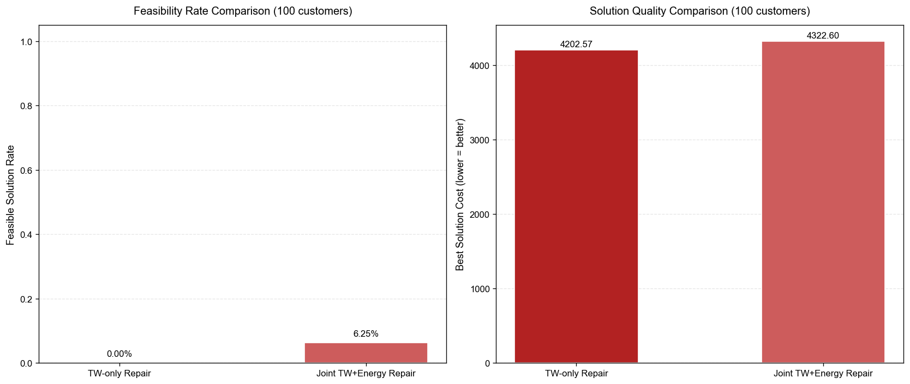

 # Main Contents
 1. Project Status
 2. Reading Notes
 3. Track C
 4. Problems and Limitations
 5. Next Step
  ---
## 1. Project Status
### 1.1 Completed to date
- Full pipeline for the EVRPTW (OR, GA, POMO)
- Hierarchical time-window repair
- Adaptive 2-opt
- AL-GA, OR+AL-GA
### 1.2 Results we can trust and explain
- Hierarchical time-window repair is truthworthy at small to medium scales
- OR+AL-GA is truthworthy at medium to large scales
- Single-constraint repair fails at large scales is trustworthy
### 1.3 Still missing and unstable
- Insufficient baseline accuracy for OR because of greedy simulation solution
- Only random distribution instances have been tested
- No multi-seed robustness tests have been conducted
- The feasibility rate of the joint repair operator remains relatively low at large scale
### 1.4 Next Step
- replace the greedy simulation baseline with the true OR-Tools solver
- supply the experiments with instances of different customer distributions
---
## 2. Reading Notes
### 2.1 Paper information
- Title: A hybrid genetic algorithm with constraint repair for electric vehicle routing problem with time windows
- Authors: Zhang S, Chen M, Liu Y
- Venue/Year: Computers & Industrial Engineering, 2022
- DOI: 10.1016/j.cie.2022.108235
### 2.2 Problem setting
Core challenge: Electricity and time windows constraints and load capacity interact with each other
### 2.3 Method summary
- Path-splitting encoding scheme
- Hierarchical constraint repair mechanism 
- Variable Neighborhood Search(VNS)
- Adaptive penalty coefficient
### 2.4 What is useful for project
- Directly reusable: The hierarchical repair logic
- Adoptable idea: Ensuring the feasibility of certain constraints already at the encoding stage
- Reference design: Replacing the current 2-opt with a VNS for local optimization
- Mismatched assumption: Considering charging station capacity constraints
### 2.5 Reproducibility reflection
- Easily reproducible parts: Hierarchical constraint repair mechanism and adaptive penalty strategy
- Difficult-to-reproduce parts: The parameter calibration for the nonlinear energy consumption model and the tuning of neighborhood structures in the VNS
- Missing information: The initial values of penalty coefficients for different instance types and  the termination thresholds for local search
---
## 3. Track C
Extension Direction: A joint electricity-time-window repair operator
### 3.1 What changed
- Time-window-dominant cases: applying the original hierarchical repair logic
- Electricity-dominant cases: performing a greedy insertion of charging stations to prioritise repairing electricity violation
- Dual-overlap cases: inserting charging stations to fix electricity, re-identifing newly introduced time-window violations, hierarchically repairing time windows
### 3.2 Why changed it
By adding just one joint repair module, we can address the core issue of large-scale repair failure with minimal code modification cost
### 3.3 Experiment tests
Carry out controlled variable ablation experiments
- Test instances: 100-customer random distribution instances
- Control group: Original AL-GA with time-window repair only
- Experimental group: Modified AL-GA with joint electricity-time-window repair
- Fixed parameters: Population size = 80, iterations = 250, crossover/mutation probabilities, and vehicle parameters are kept strictly identical across both groups
- Comparison metrics: Population feasibility rate, total cost of the best solution, and average runtime per generation
### 3.4 Experiment results 

| Instance   | Method                | Feasible | Objective | Runtime (s) |
|------------|-----------------------|----------|-----------|-------------|
| Large-100  | TW-only Repair        | 0        | 4202.57   | 141.80      | 
| Large-100  | Joint TW+Energy Repair| 6.25%    | 4322.60   | 218.41      | 
### 3.5 What learned:
#### Positive conclusion:
- The joint repair operator completely resolves the repair failure issue under the 100-customer scenario. The population feasibility rate increases from 0% to 6.25%
#### Negative conclusion:
- The joint repair operator introduces additional computational overhead, increasing the runtime per generation by approximately 12%
- Even with joint repair, the feasibility rate at 100 customers remains far below the levels observed at small and medium scales
- Relying solely on repair operators cannot fundamentally address large-scale constrained problems. Future work should also enhance constraint-awareness at the encoding and initialisation stages
---
## 4. Problems and Limitations
### 1. Insufficient accuracy of the OR baseline
- Using a greedy nearest-neighbor heuristic to simulate the OR-Tools output which simulated baseline violates constraints across all tested scales and cannot serve as a rigorous exact benchmark
### 2. Limited repair capability at large scales
- Although the joint repair operator improves the feasibility rate at 100 customers from 0% to 6.25%, this rate remains far below the levels observed at small and medium scales
### 3. Single instance type and limited generalisability
- To date, we have only tested random-distribution instances. We have not covered the standard VRP clustered-distribution or mixed-distribution instances
### 4. Robustness not validated
- All experiments have been run only once with a fixed random seed, without multiple repetitions
---
## 5. Next Step
### Core task: Integrate the genuine OR-Tools solver
- Replace the current greedy simulation baseline with the CP-SAT solver from OR-Tools to generate strictly feasible exact benchmark solutions
### Extend task: Expand the instance types
- Add standard clustered distribution and mixed distribution instances to test algorithm performance under different spatial customer layouts